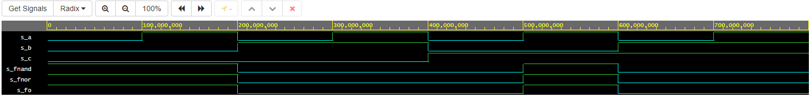

# LAB 01-gates

### Link to GitHub repository [*Digital-electronics-1*](https://github.com/xknobm00/Digital-electronics-1)

## Lab assignment

### Verification of De Morgan's laws of function f(c,b,a).

Link to EDA PlayGround [De Morgan's laws](https://www.edaplayground.com/x/fDPy)



| **c** | **b** |**a** | **f(c,b,a)** |
| :-: | :-: | :-: | :-: |
| 0 | 0 | 0 | 1 |
| 0 | 0 | 1 | 1 |
| 0 | 1 | 0 | 0 |
| 0 | 1 | 1 | 0 |
| 1 | 0 | 0 | 0 |
| 1 | 0 | 1 | 1 |
| 1 | 1 | 0 | 0 |
| 1 | 1 | 1 | 0 |

#### Listing of VHDL code design.vhd
```vhdl
------------------------------------------------------------------------
--
-- Example of basic OR, AND, XOR gates.
-- Nexys A7-50T, Vivado v2020.1, EDA Playground
--
-- Copyright (c) 2019-2020 Tomas Fryza
-- Dept. of Radio Electronics, Brno University of Technology, Czechia
-- This work is licensed under the terms of the MIT license.
--
------------------------------------------------------------------------

library ieee;               -- Standard library
use ieee.std_logic_1164.all;-- Package for data types and logic operations

------------------------------------------------------------------------
-- Entity declaration for basic gates
------------------------------------------------------------------------
entity gates is
    port(
        a_i     : in  std_logic;         -- Data input
        b_i     : in  std_logic;         -- Data input
        c_i     : in  std_logic;         -- Data input
        for_o   : out std_logic;         -- OR output function
        fand_o  : out std_logic;         -- AND output function
        fxor_o  : out std_logic;         -- XOR output function
        fnor_o  : out std_logic;        -- NOR
        fnand_o : out std_logic;        -- NAND
        f_o 	: out std_logic;          -- De Morgan's Law function
        x1_o	: out std_logic; 
        x2_o	: out std_logic;
        x3_o	: out std_logic;
        x4_o	: out std_logic 
        
    );
end entity gates;

------------------------------------------------------------------------
-- Architecture body for basic gates
------------------------------------------------------------------------
architecture dataflow of gates is
begin
	f_o	    <= ((not b_i) and a_i) or ((not c_i) and (not b_i));				         	--De Morgan's Law
    fnand_o <= not((not ((not b_i) and a_i)) and not((not c_i) and(not b_i)));	--AND
    fnor_o	<= (not(b_i or (not a_i))) or (not (c_i or b_i));			          		--OR
    x1_o 	<= a_i and not(a_i);
    x2_o	<= a_i or not(a_i);
    x3_o	<= a_i or a_i or a_i;
    x4_o	<= a_i and a_i and a_i;

end architecture dataflow;

### Verification of Distributive laws.

Link to EDA PlayGround [Distributive laws](https://www.edaplayground.com/x/fDPy)
