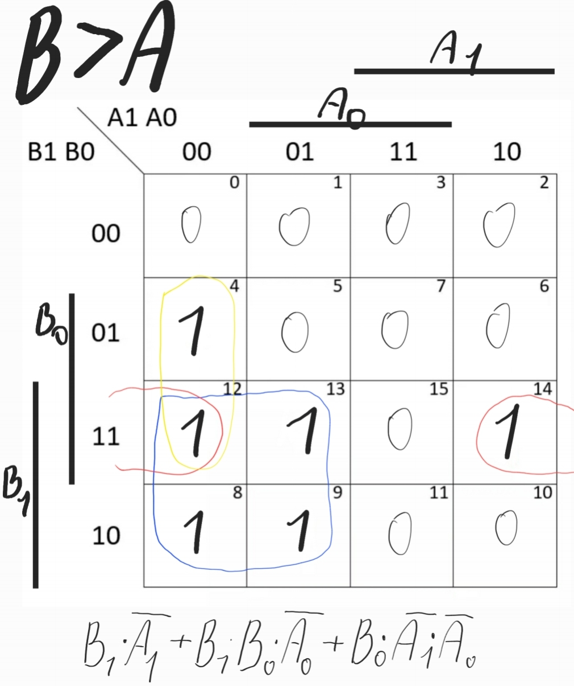

# Lab 2: Combinational logic

## Preparation tasks (done before the lab at home)

*Digital* or *Binary comparator* compares the digital signals A, B presented at input terminal and produce outputs depending upon the condition of those inputs. Complete the truth table for 2-bit *Identity comparator* (B equals A), and two *Magnitude comparators* (B is greater than A, B is less than A). Note that, such a digital device has four inputs and three outputs/functions.

| **Dec. equivalent** | **B[1:0]** | **A[1:0]** | **B is greater than A** | **B equals A** | **B is less than A** |
| :-: | :-: | :-: | :-: | :-: | :-: |
| 0 | 0 0 | 0 0 | 0 | 1 | 0 |
| 1 | 0 0 | 0 1 | 0 | 0 | 1 |
| 2 | 0 0 | 1 0 | 0 | 0 | 1 |
| 3 | 0 0 | 1 1 | 0 | 0 | 1 |
| 4 | 0 1 | 0 0 | 1 | 0 | 0 |
| 5 | 0 1 | 0 1 | 0 | 1 | 0 |
| 6 | 0 1 | 1 0 | 0 | 0 | 1 |
| 7 | 0 1 | 1 1 | 0 | 0 | 1 |
| 8 | 1 0 | 0 0 | 1 | 0 | 0 |
| 9 | 1 0 | 0 1 | 1 | 0 | 0 |
| 10 | 1 0 | 1 0 | 0 | 1 | 0 |
| 11 | 1 0 | 1 1 | 0 | 0 | 1 |
| 12 | 1 1 | 0 0 | 1 | 0 | 0 |
| 13 | 1 1 | 0 1 | 1 | 0 | 0 |
| 14 | 1 1 | 1 0 | 1 | 0 | 0 |
| 15 | 1 1 | 1 1 | 0 | 1 | 0 |


**equals_SoP** = (/b1*/b0*/a1*/a0)+(/b1*b0*/a1*a0)+(b1*/b0*a1*/a0)+(b1*b0*a1*a0)

**less_PoS** = (b1+b0+a1+a0)*(b1+/b0+a1+a0)*(b1+/b0+a1+/a0)*(/b1+b0+a1+a0)*(/b1+b0+a1+/a0)*(/b1+b0+/a1+a0)*(/b1+/b0+a1+a0)*(/b1+/b0+a1+/a0)*(/b1+/b0+/a1+a0)*(/b1+/b0+/a1+/a0)

**greater_PoS** = (b1 + b0 + a1 + a0) * (b1 + b0 + a1 + /a0) * (b1 + b0 + /a1 + a0) * (b1 + b0 + /a1 + /a0) * (b1 + /b0 + a1 + /a0) * 
            (b1 + /b0 + /a1 + a0) * (b1 + /b0 + /a1 + /a0) * (/b1 + b0 + /a1 + a0) * (/b1 + b0 + /a1 + /a0) * (/b1 + /b0 + /a1 + /a0)

*" /" ... is negation*


## Logic function minimization

Use K-maps to create a simplified SoP form of the "greater than" function and a PoS form of the "less than" function.

### Karnaugh map for "greater" function


### Karnaugh map for "equals" function


### Karnaugh map for "less" function


## A 4-bit binary comparator

### Listing of VHDL code (design.vhd)

``` vhdl
------------------------------------------------------------------------
--
-- Example of 2-bit binary comparator using the when/else assignment.
-- EDA Playground
--
-- Copyright (c) 2020-2021 Tomas Fryza
-- Dept. of Radio Electronics, Brno University of Technology, Czechia
-- This work is licensed under the terms of the MIT license.
--
------------------------------------------------------------------------

library ieee;
use ieee.std_logic_1164.all;

------------------------------------------------------------------------
-- Entity declaration for 2-bit binary comparator
------------------------------------------------------------------------
entity comparator_4bit is
    port(
        a_i           : in  std_logic_vector(4 - 1 downto 0);
        b_i           : in  std_logic_vector(4 - 1 downto 0);


        -- COMPLETE ENTITY DECLARATION

        B_greater_A_o  : out std_logic;
        B_equals_A_o   : out std_logic;
        B_less_A_o     : out std_logic       -- B is less than A
        
    );
end entity comparator_4bit;

------------------------------------------------------------------------
-- Architecture body for 2-bit binary comparator
------------------------------------------------------------------------
architecture Behavioral of comparator_4bit is
begin
    
    B_equals_A_o  <= '1' when (b_i > a_i) else '0';
    B_greater_A_o <= '1' when (b_i = a_i) else '0';
    B_less_A_o    <= '1' when (b_i < a_i) else '0';
    -- WRITE "GREATER" AND "EQUALS" ASSIGNMENTS HERE


end architecture Behavioral;
```

### Listing of VHDL testbench (testbench.vhd)

``` vhdl
------------------------------------------------------------------------
--
-- Testbench for 2-bit binary comparator.
-- EDA Playground
--
-- Copyright (c) 2020-2021 Tomas Fryza
-- Dept. of Radio Electronics, Brno University of Technology, Czechia
-- This work is licensed under the terms of the MIT license.
--
------------------------------------------------------------------------

library ieee;
use ieee.std_logic_1164.all;

------------------------------------------------------------------------
-- Entity declaration for testbench
------------------------------------------------------------------------
entity tb_comparator_2bit is
    -- Entity of testbench is always empty
end entity tb_comparator_2bit;

------------------------------------------------------------------------
-- Architecture body for testbench
------------------------------------------------------------------------
architecture testbench of tb_comparator_2bit is

    -- Local signals
    signal s_a            : std_logic_vector(4 - 1 downto 0);
    signal s_b            : std_logic_vector(4 - 1 downto 0);
    signal s_B_greater_A  : std_logic;
    signal s_B_equals_A   : std_logic;
    signal s_B_less_A     : std_logic;

begin
    -- Connecting testbench signals with comparator_2bit entity (Unit Under Test)
    uut_comparator_4bit : entity work.comparator_4bit
        port map(
            a_i           => s_a,
            b_i           => s_b,
            B_greater_A_o => s_B_greater_A,
            B_equals_A_o  => s_B_equals_A,
            B_less_A_o    => s_B_less_A
        );

    --------------------------------------------------------------------
    -- Data generation process
    --------------------------------------------------------------------
    p_stimulus : process
    begin
        -- Report a note at the begining of stimulus process
        report "Stimulus process started" severity note;


        -- First test values
        s_b <= "0000"; s_a <= "0000"; wait for 100 ns;
        -- Expected output
        assert ((s_B_greater_A = '0') and (s_B_equals_A = '1') and (s_B_less_A = '1'))
        -- If false, then report an error
        report "Test failed for input combination: 0000, 0000" severity error;
        
        -- First test values
        s_b <= "0000"; s_a <= "0001"; wait for 100 ns;
        -- Expected output
        assert ((s_B_greater_A = '0') and (s_B_equals_A = '0') and (s_B_less_A = '0'))
        -- If false, then report an error
        report "Test failed for input combination: 0000, 0001" severity error;
        
         -- First test values
        s_b <= "0000"; s_a <= "0010"; wait for 100 ns;
        -- Expected output
        assert ((s_B_greater_A = '0') and (s_B_equals_A = '0') and (s_B_less_A = '1'))
        -- If false, then report an error
        report "Test failed for input combination: 0000, 0010" severity error;
        
         -- First test values
        s_b <= "0000"; s_a <= "0011"; wait for 100 ns;
        -- Expected output
        assert ((s_B_greater_A = '0') and (s_B_equals_A = '0') and (s_B_less_A = '1'))
        -- If false, then report an error
        report "Test failed for input combination: 0000, 0011" severity error;
        
        
         -- First test values
        s_b <= "0000"; s_a <= "0100"; wait for 100 ns;
        -- Expected output
        assert ((s_B_greater_A = '0') and (s_B_equals_A = '0') and (s_B_less_A = '1'))
        -- If false, then report an error
        report "Test failed for input combination: 0000, 0100" severity error;
        
         -- First test values
        s_b <= "0000"; s_a <= "0101"; wait for 100 ns;
        -- Expected output
        assert ((s_B_greater_A = '0') and (s_B_equals_A = '0') and (s_B_less_A = '1'))
        -- If false, then report an error
        report "Test failed for input combination: 0000, 0101" severity error;
        
         -- First test values
        s_b <= "0000"; s_a <= "0110"; wait for 100 ns;
        -- Expected output
        assert ((s_B_greater_A = '0') and (s_B_equals_A = '0') and (s_B_less_A = '1'))
        -- If false, then report an error
        report "Test failed for input combination: 0000, 0110" severity error;
        
         -- First test values
        s_b <= "0000"; s_a <= "0111"; wait for 100 ns;
        -- Expected output
        assert ((s_B_greater_A = '0') and (s_B_equals_A = '0') and (s_B_less_A = '1'))
        -- If false, then report an error
        report "Test failed for input combination: 0000, 0111" severity error;
        
         -- First test values
        s_b <= "0000"; s_a <= "1000"; wait for 100 ns;
        -- Expected output
        assert ((s_B_greater_A = '0') and (s_B_equals_A = '0') and (s_B_less_A = '1'))
        -- If false, then report an error
        report "Test failed for input combination: 0000, 1000" severity error;
        
         -- First test values
        s_b <= "0000"; s_a <= "1001"; wait for 100 ns;
        -- Expected output
        assert ((s_B_greater_A = '0') and (s_B_equals_A = '0') and (s_B_less_A = '1'))
        -- If false, then report an error
        report "Test failed for input combination: 0000, 1001" severity error;
        
        -- WRITE OTHER TESTS HERE


        -- Report a note at the end of stimulus process
        report "Stimulus process finished" severity note;
        wait;
    end process p_stimulus;

end architecture testbench;

```

### Listing of simulator console output with reported error

``` vhdl
[2021-02-17 12:29:42 EST] ghdl -i design.vhd testbench.vhd  && ghdl -m  tb_comparator_2bit && ghdl -r  tb_comparator_2bit   --vcd=dump.vcd && sed -i 's/^U/X/g; s/^-/X/g; s/^H/1/g; s/^L/0/g' dump.vcd 
analyze design.vhd
analyze testbench.vhd
elaborate tb_comparator_2bit
testbench.vhd:51:9:@0ms:(report note): Stimulus process started
testbench.vhd:57:9:@100ns:(assertion error): Test failed for input combination: 0000, 0000
testbench.vhd:64:9:@200ns:(assertion error): Test failed for input combination: 0000, 0001
testbench.vhd:129:9:@1us:(report note): Stimulus process finished
Finding VCD file...
./dump.vcd
[2021-02-17 12:29:43 EST] Opening EPWave...
Done
```

[Link to your public EDA Playground example](https://www.edaplayground.com/x/nGQ_)


