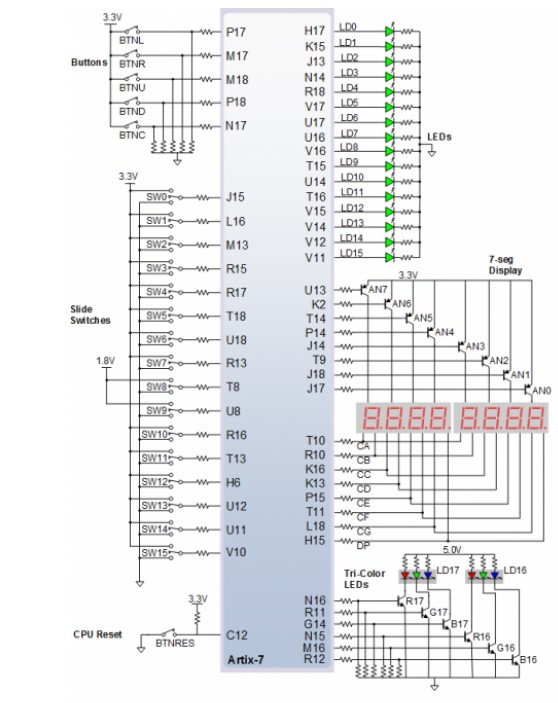

# Lab 4: Seven-segment display decoder

## 1. Preparation tasks 

Figure with connection of 7-segment displays on Nexys A7 board



**Complete the decoder truth table for common anode 7-segment display**

| **Hex** | **Inputs** | **A** | **B** | **C** | **D** | **E** | **F** | **G** |
| :-: | :-: | :-: | :-: | :-: | :-: | :-: | :-: | :-: |
| 0 | 0000 | 0 | 0 | 0 | 0 | 0 | 0 | 1 |
| 1 | 0001 | 1 | 0 | 0 | 1 | 1 | 1 | 1 |
| 2 | 0010 | 0 | 0 | 1 | 0 | 0 | 1 | 0 |
| 3 | 0011 | 0 | 0 | 0 | 0 | 1 | 1 | 0 |
| 4 | 0100 | 1 | 0 | 0 | 1 | 1 | 0 | 0 | 
| 5 | 0101 | 0 | 1 | 0 | 0 | 1 | 0 | 0 |
| 6 | 0110 | 0 | 1 | 0 | 0 | 0 | 0 | 0 |
| 7 | 0111 | 0 | 0 | 0 | 1 | 1 | 1 | 1 |
| 8 | 1000 | 0 | 0 | 0 | 0 | 0 | 0 | 0 |
| 9 | 1001 | 0 | 0 | 0 | 0 | 1 | 0 | 0 |
| A | 1010 | 0 | 0 | 0 | 1 | 0 | 0 | 0 |
| b | 1011 | 1 | 1 | 0 | 0 | 0 | 0 | 0 |
| C | 1100 | 0 | 1 | 1 | 0 | 0 | 0 | 1 |
| d | 1101 | 1 | 0 | 0 | 0 | 0 | 1 | 0 |
| E | 1110 | 0 | 1 | 1 | 0 | 0 | 0 | 0 |
| F | 1111 | 0 | 1 | 1 | 1 | 0 | 0 | 0 |


## 2. Seven-segment display decoder. Submit:

**Listing of VHDL architecture from source file hex_7seg.vhd with syntax highlighting**

```vhdl
library IEEE;
use IEEE.STD_LOGIC_1164.ALL;

-- Uncomment the following library declaration if using
-- arithmetic functions with Signed or Unsigned values
--use IEEE.NUMERIC_STD.ALL;

-- Uncomment the following library declaration if instantiating
-- any Xilinx leaf cells in this code.
--library UNISIM;
--use UNISIM.VComponents.all;

entity hex_7seg is
    Port ( hex_i : in STD_LOGIC_VECTOR (4-1 downto 0);
           seg_o : out STD_LOGIC_VECTOR (7-1 downto 0));
end hex_7seg;

architecture Behavioral of hex_7seg is

begin
 --------------------------------------------------------------------
    -- p_7seg_decoder:
    -- A combinational process for 7-segment display (Common Anode)
    -- decoder. Any time "hex_i" is changed, the process is "executed".
    -- Output pin seg_o(6) controls segment A, seg_o(5) segment B, etc.
    --       segment A
    --        | segment B
    --        |  | segment C
    --        |  |  |   ...   segment G
    --        +-+|+-+          |
    --          |||            |
    -- seg_o = "0000001"-------+
    --------------------------------------------------------------------
    p_7seg_decoder : process(hex_i)
    begin
        case hex_i is
            when "0000" =>
                seg_o <= "0000001";     -- 0
            when "0001" =>
                seg_o <= "1001111";     -- 1

            when "0010" =>
                seg_o <= "0010010";     -- 2
                
            when "0011" =>
                seg_o <= "0000110";     -- 3
                
            when "0100" =>
                seg_o <= "1001100";     -- 4
                
            when "0101" =>
                seg_o <= "0100100";     -- 5
                
            when "0110" =>
                seg_o <= "0100000";     -- 6
                
            when "0111" =>
                seg_o <= "0001111";     -- 7
                                                                                

            when "1000" =>
                seg_o <= "0000000";     -- 8
                
            when "1001" =>
                seg_o <= "0000100";     -- 9
                
            when "1010" =>
                seg_o <= "0001000";     -- A                

            when "1011" =>
                seg_o <= "1100000";     -- b
                
            when "1100" =>
                seg_o <= "0110001";     -- C
                
            when "1101" =>
                seg_o <= "1000010";     -- d                                

            when "1110" =>
                seg_o <= "0110000";     -- E
            when others =>
                seg_o <= "0111000";     -- F
        end case;
    end process p_7seg_decoder;

end Behavioral;
```

**Listing of VHDL stimulus process from testbench file tb_hex_7seg.vhd with syntax highlighting and asserts**

```vhdl
p_stimulus : process
    begin
        -- Report a note at the begining of stimulus process
        report "Stimulus process started" severity note;

        s_hex <= "0000"; wait for 10 ns;       -- 0
        
        s_hex <= "0001"; wait for 10 ns;       -- 1
        
        s_hex <= "0010"; wait for 10 ns;       -- 2         
        
        s_hex <= "0011"; wait for 10 ns;       -- 3
        
        s_hex <= "0100"; wait for 10 ns;       -- 4
        
        s_hex <= "0101"; wait for 10 ns;       -- 5
        
        s_hex <= "0110"; wait for 10 ns;       -- 6
        
        s_hex <= "0111"; wait for 10 ns;       -- 7
        
        s_hex <= "1000"; wait for 10 ns;       -- 8
        
        s_hex <= "1001"; wait for 10 ns;       -- 9
        
        s_hex <= "1010"; wait for 10 ns;       -- A
        
        s_hex <= "1011"; wait for 10 ns;       -- b
        
        s_hex <= "1100"; wait for 10 ns;       -- C
        
        s_hex <= "1101"; wait for 10 ns;       -- d
        
        s_hex <= "1110"; wait for 10 ns;       -- E
        
        s_hex <= "1111"; wait for 10 ns;       -- F
        
        
        report "Stimulus process finished" severity note;
        wait;
    end process p_stimulus;       
        
```

Screenshot with simulated time waveforms


