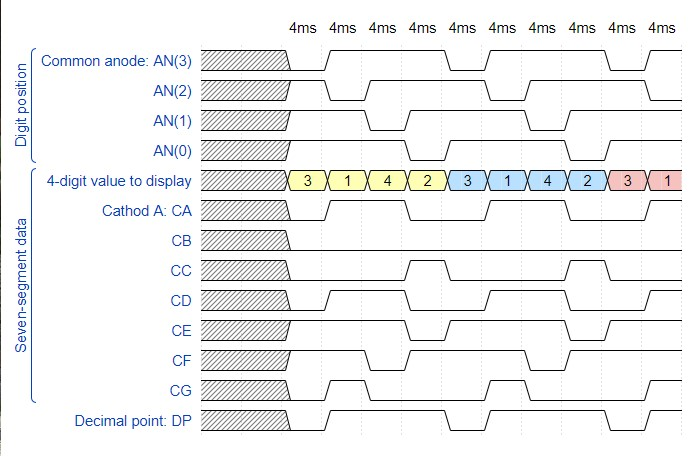

# Lab 6: Driver for multiple seven-segment displays

## 1.Preparation tasks (done before the lab at home).
   * Timing diagram figure for displaying value 



## 2. Display driver.

   * Listing of VHDL code of the process `p_mux` with syntax highlighting.

``` vhdl
 p_mux : process(s_cnt, data0_i, data1_i, data2_i, data3_i, dp_i)
    begin
        case s_cnt is
            when "11" =>
                s_hex <= data3_i;
                dp_o  <= dp_i(3);
                dig_o <= "0111";

            when "10" =>
                --- WRITE YOUR CODE HERE
                s_hex <= data2_i;
                dp_o  <= dp_i(2);
                dig_o <= "1011";

            when "01" =>
                --- WRITE YOUR CODE HERE
                s_hex <= data1_i;
                dp_o  <= dp_i(1);
                dig_o <= "1101";

            when others =>
                --- WRITE YOUR CODE HERE
                s_hex <= data0_i;
                dp_o  <= dp_i(0);
                dig_o <= "1110";
        end case;
        
    end process p_mux;

```


   * Listing of VHDL testbench file `tb_driver_7seg_4digits` with syntax highlighting and asserts,


   * Screenshot with simulated time waveforms; always display all inputs and outputs,


   * Listing of VHDL architecture of the top layer.


