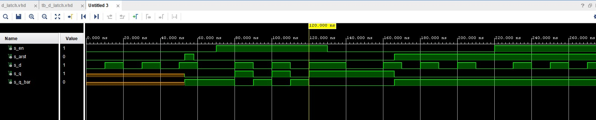

# Lab 7: Latches and Flip-flops

## Lab assignment

1. Preparation tasks (done before the lab at home). 
    * Characteristic equations and completed tables for D, JK, T flip-flops.
   
   **q** n+1 (D) = d
   
   **q** n+1 (JK) = j * /q(2) + /k * q(n)
   
   **q** n+1 (T) = t * /q(n) + /t * q(n)
   
   
   | **clk** | **d** | **q(n)** | **q(n+1)** | **Comments** |
   | :-: | :-: | :-: | :-: | :-- |
   |  | 0 | 0 | 0  | no change |
   |  | 0 | 1 | 0 | change |
   |  | 1 | 0 | 1 | change |
   |  | 1 | 1 | 1 | no change |

   | **clk** | **j** | **k** | **q(n)** | **q(n+1)** | **Comments** |
   | :-: | :-: | :-: | :-: | :-: | :-- |
   |  | 0 | 0 | 0 | 0 | No change |
   |  | 0 | 0 | 1 | 1 | No change |
   |  | 0 | 1 | 0 | 0 | reset |
   |  | 0 | 1 | 1 | 0 | reset |
   |  | 1 | 0 | 0 | 1 | set |
   |  | 1 | 0 | 1 | 1 | set |
   |  | 1 | 1 | 0 | 1 | toggle |
   |  | 1 | 1 | 1 | 0 | toggle |

   | **clk** | **t** | **q(n)** | **q(n+1)** | **Comments** |
   | :-: | :-: | :-: | :-: | :-- |
   |  | 0 | 0 | 0 | no change |
   |  | 0 | 1 | 1 | no change |
   |  | 1 | 0 | 1 | toggle |
   |  | 1 | 1 | 0 | toggle |
    

2. D latch.
    * VHDL code listing of the process `p_d_latch` with syntax highlighting,
    
``` vhdl
    p_d_latch : process (d, arst, en)
    begin
        if (arst = '1') then
            q       <= '0';
            q_bar   <= '1';
            
        elsif (en = '1') then
            q <= d;
            q_bar   <= not d;
            
        end if;
    end process p_d_latch;
```

    * Listing of VHDL reset and stimulus processes from the testbench `tb_d_latch` file with syntax highlighting and asserts,
    
``` vhdl
    p_reset_gen : process
    begin
            s_arst <= '0';
            wait for 53 ns;
            
            -- Reset activated
            s_arst <= '1';   
            wait for 5 ns;
            
            -- Reset deactivated
            s_arst <= '0';
            wait for 108 ns;
            
            s_arst <= '1';
          
            
            
            wait;
        end process p_reset_gen;
    
    p_stimulus: process
    begin
        -- Report a note at the begining of stimulus process
        report "Stimulus process started" severity note;
        
        s_en <= '0';
        s_d  <= '0';
        
        --d sequence
        wait for 10 ns;
        s_d  <= '1';
        wait for 10 ns;
        s_d  <= '0';
        wait for 10 ns;
        s_d  <= '1';
        wait for 10 ns;
        s_d  <= '0';
        wait for 10 ns;
        s_d  <= '1';
        wait for 10 ns;
        s_d  <= '0';
        wait for 10 ns;
        --/d sequence
        
        s_en <= '1';
        
        wait for 3 ns;
        assert(s_q = '0' and s_q_bar = '1')
        report "assert" severity error;
        
        --d sequence
        wait for 7 ns;
        s_d  <= '1';
        wait for 10 ns;
        s_d  <= '0';
        wait for 10 ns;
        s_d  <= '1';
        wait for 10 ns;
        s_d  <= '0';
        wait for 10 ns;
        s_d  <= '1';
        wait for 10 ns;
        s_en <= '0';
        wait for 10 ns;
        s_d  <= '0';
        wait for 10 ns;
        --/d sequence        
        
        wait for 3 ns;
        assert(s_q = '1' and s_q_bar = '0')
        report "assert" severity error;
 
        --d sequence
        wait for 7 ns;
        s_d  <= '1';
        wait for 10 ns;
        s_d  <= '0';
        wait for 10 ns;
        s_d  <= '1';
        wait for 10 ns;
        s_d  <= '0';
        wait for 10 ns;
        s_d  <= '1';
        wait for 10 ns;
        s_d  <= '0';
        wait for 10 ns;
        --/d sequence 
        
        s_en <= '1'; 
        
        wait for 3 ns;
        assert(s_q = '0' and s_q_bar = '1')
        report "assert" severity error;       
        
        --d sequence
        wait for 7 ns;
        s_d  <= '1';
        wait for 10 ns;
        s_d  <= '0';
        wait for 10 ns;
        s_d  <= '1';
        wait for 10 ns;
        s_d  <= '0';
        wait for 10 ns;
        s_d  <= '1';
        wait for 10 ns;
        s_d  <= '0';
        wait for 10 ns;
        --/d sequence         
        

        report "Stimulus process finished. " severity note;
        
        wait;
        end process p_stimulus;
```
    
    * Screenshot with simulated time waveforms; always display all inputs and outputs. The full functionality of the entity must be verified.



3. Flip-flops.
    * VHDL code listing of the processes `p_d_ff_arst`, `p_d_ff_rst`, `p_jk_ff_rst`, `p_t_ff_rst` with syntax highlighting,
    
    
    * Listing of VHDL clock, reset and stimulus processes from the testbench files with syntax highlighting and asserts,
    
    
    * Screenshot, with simulated time waveforms; always display all inputs and outputs. The full functionality of the entities must be verified.


4. Shift register.
    * Image of the shift register schematic. The image can be drawn on a computer or by hand. Name all inputs, outputs, components and internal signals.

